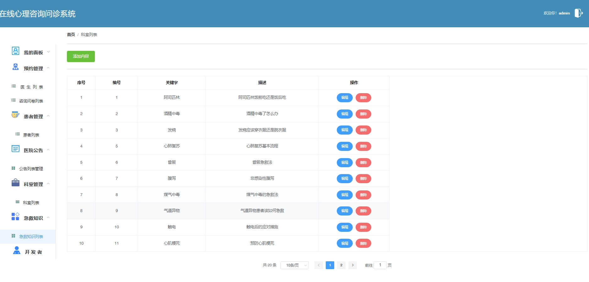

# 1.项目介绍
- 项目角色：管理员、患者（普通用户）、医师
- 项目模块：医生管理、患者管理、科室管理、咨询管理、预约管理、急救知识、患者病历等
- 测试环境：idea2024、tomcat8.5、maven3、jdk8、nodeV14.16.1、mysql5.7
- 技术栈：SSM、vue等
# 2.项目部署
## 2.1 后端启动
- 创建数据库，导入file/db.sql文件
- 通过idea打开xinli项目，本根据上一步创建的数据库修改src/main/resources/database.properties  1-4行，本地数据库版本为8.0的自行百度和5.7配置区别
- 配置tomcat，启动项目
## 2.2 vue项目启动
- 通过idea（已安装vue.js插件），或者webstorm，vscode等ide工具打开项目front-web
- 项目我保留了node_modules，看个人情况使用，我的本地node版本是14.16.1，可以直接执行 npm run serve
- 如果你是其他版本，可以执行 npm install 后再执行 npm run serve
# 3.项目部分截图

# 4.获取方式
[戳我查看](https://gitee.com/aven999/mall)
